

  
  <h1>✨ Reimagine YouTube: A Stunning, Next-Gen Experience</h1>
  
Dive into a sleek, modern YouTube redesign, crafted with the power of Kotlin/JS and Jetpack Compose for Web. Experience your favorite content like never before!

  <a href="https://youtuberedesignedv2.netlify.app/">🚀 Explore the Live Demo</a>

---

## Tired of the same old YouTube interface? 🥱

Imagine a YouTube that's not just functional, but visually breathtaking. We've taken the brilliant design concepts from [Juxtopposed](https://www.youtube.com/@juxtopposed) (huge thanks for the inspiration! 🙌) and brought them to life with cutting-edge web technology.

## Why You'll Love This Redesign:

* **Modern & Intuitive:** A fresh, clean interface that enhances your viewing experience. 🌟
* **Powered by Kotlin/JS & Kobweb:** Experience the future of web development with seamless performance and elegant code. 💻
* **Jetpack Compose for Web Magic:** Leverage the power of Compose to build beautiful, responsive UIs with ease. ✨
* **Feature-Rich:** From dynamic drawers and intuitive playlists to immersive theater mode, we've got you covered. 🎬
* **Keyboard Shortcuts:** Navigate like a pro with intuitive keyboard controls for the video player. ⌨️

# Screenshots: A Visual Feast 🌄

## Home
A personalized gateway to your favorite content.

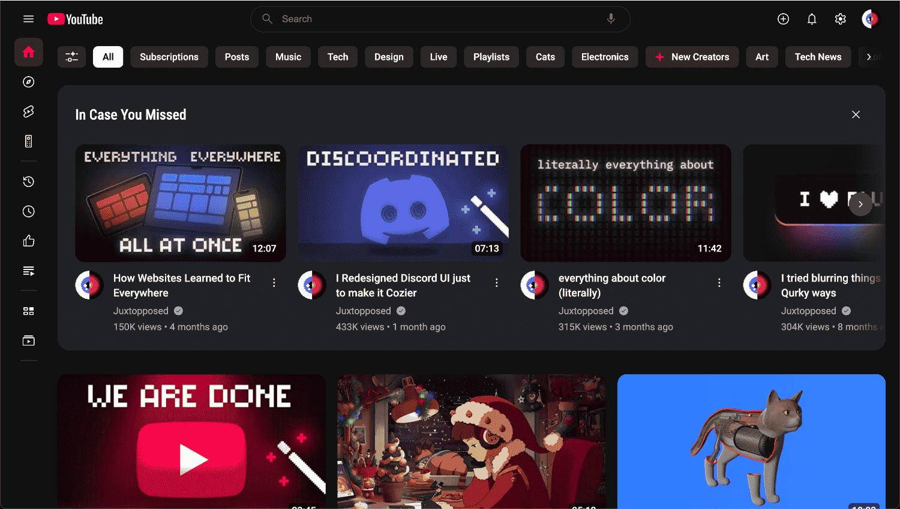

## Notifications Panel
Stay updated with a beautifully designed notification hub.

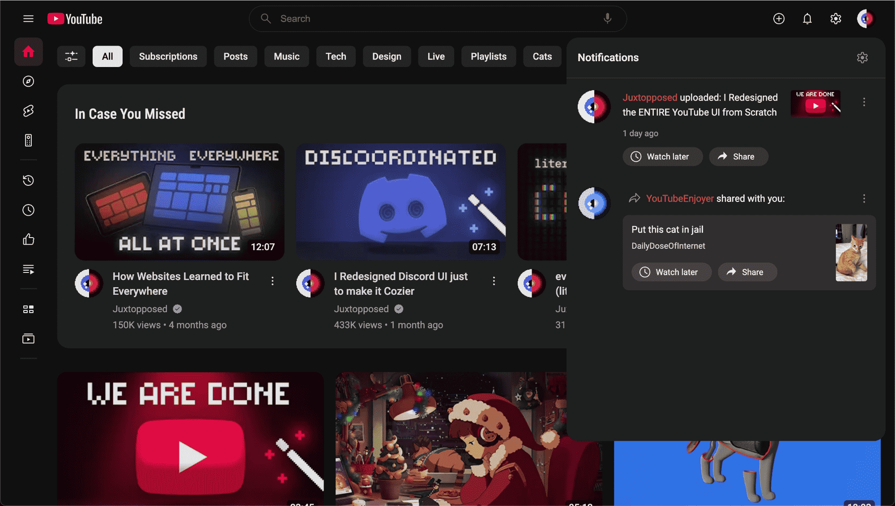

## Dynamic Drawer
Fluid animations and seamless navigation.

## Trending & Short
Discover what's hot with a visually engaging layout.

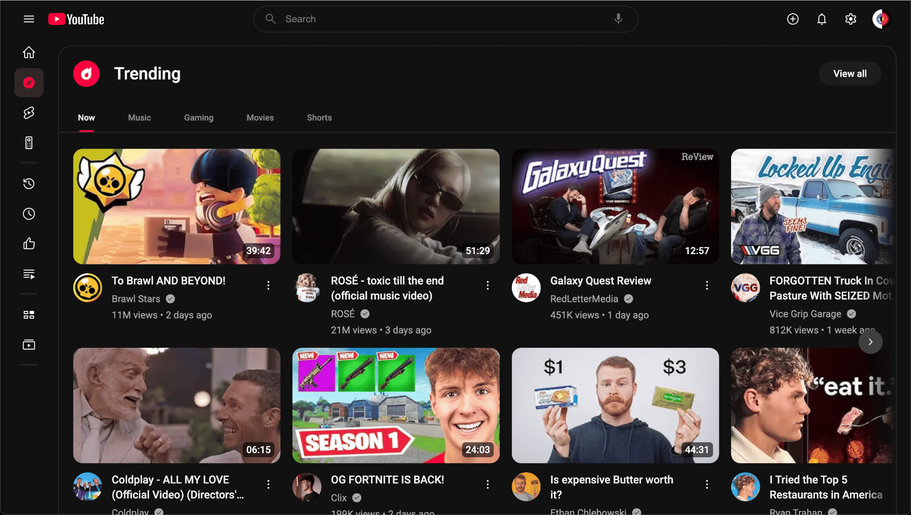 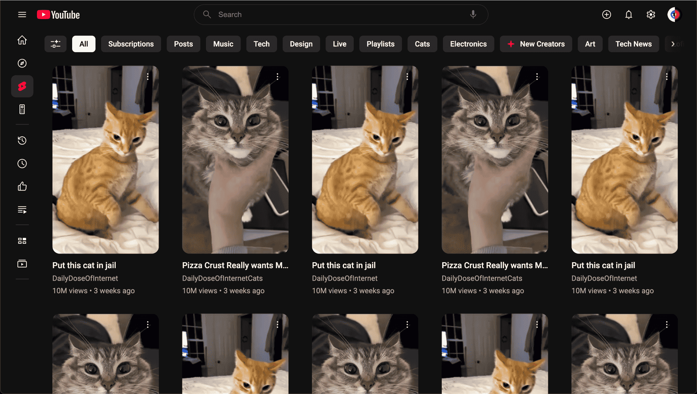

## Immersive Short Experience
Enjoy shorts with a dedicated, focused interface.

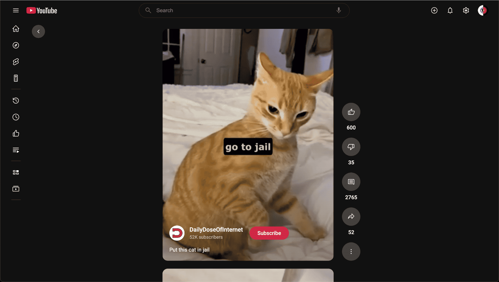

## TV Mode & History
Relax and catch up on your viewing history with ease.

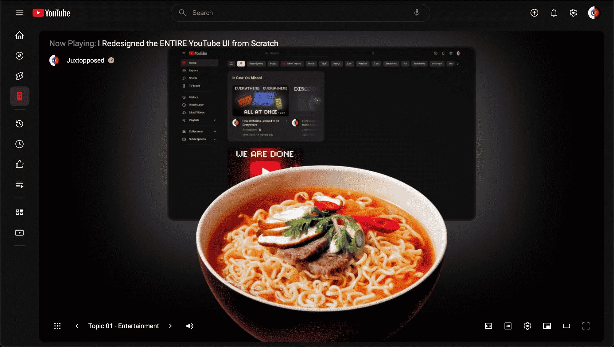 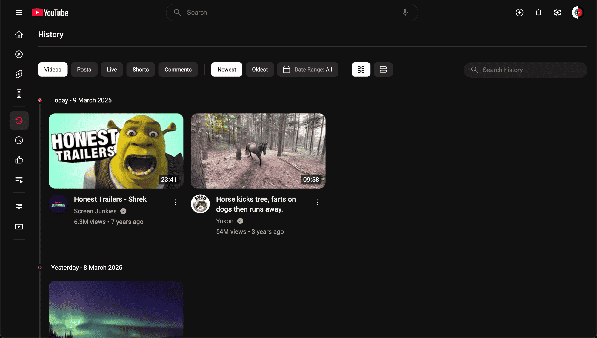

## Playlist Reordering
Effortlessly organize your playlists with a simple drag-and-drop.

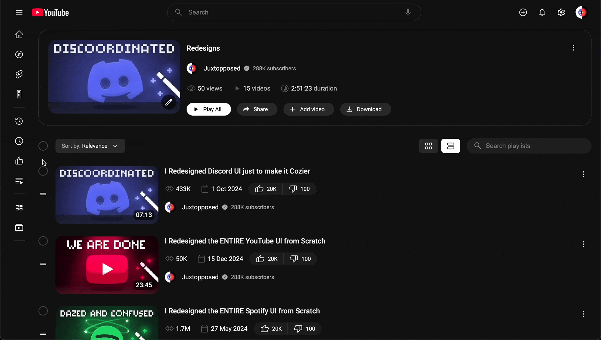

## Subscriptions & Video Player
Dive into your subscriptions and enjoy videos with enhanced controls.

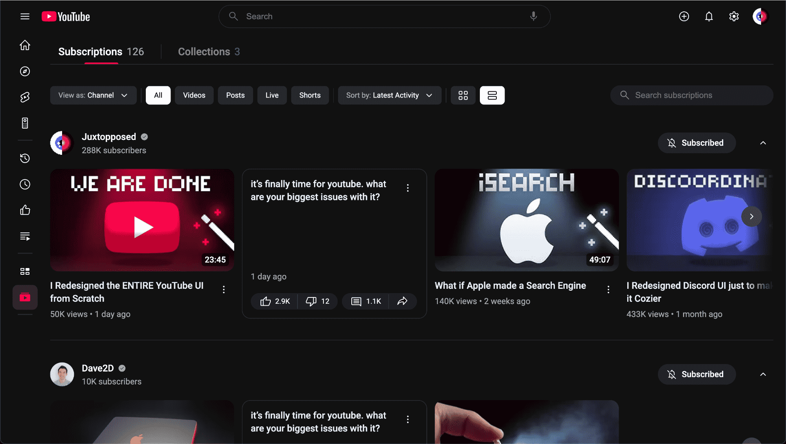 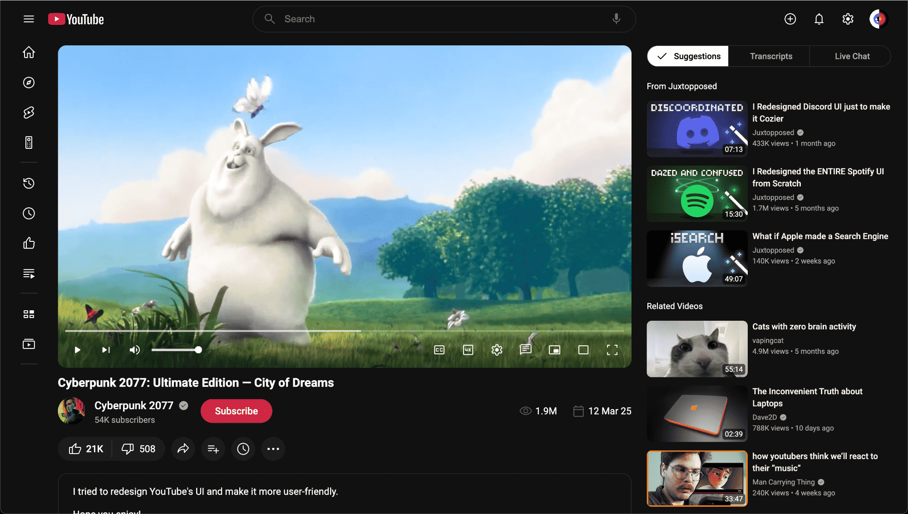

## Theater & Fullscreen Modes
Immerse yourself in the content with stunning visual modes.

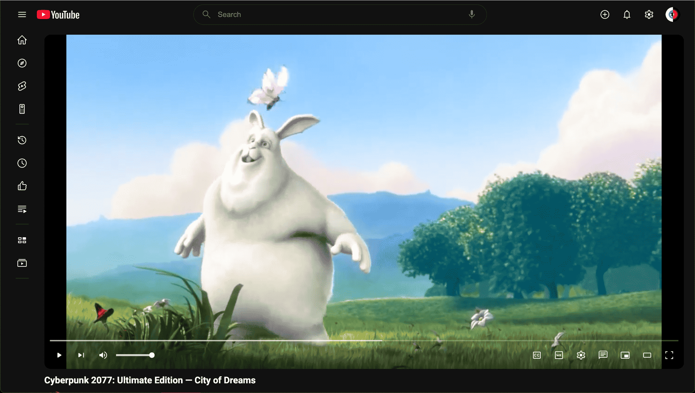

## Live Chat & Channel Details
Engage with live chats and explore channel information seamlessly.

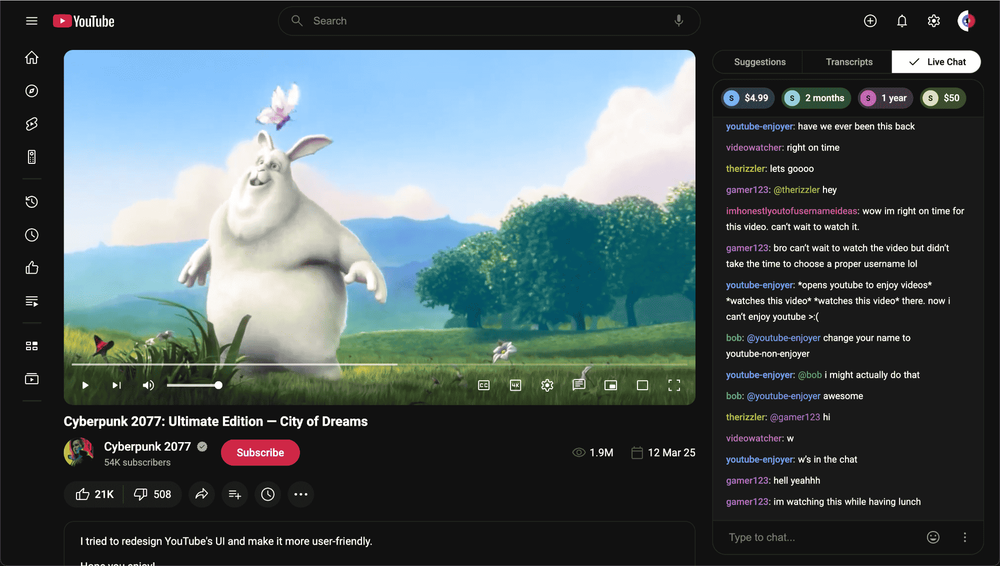 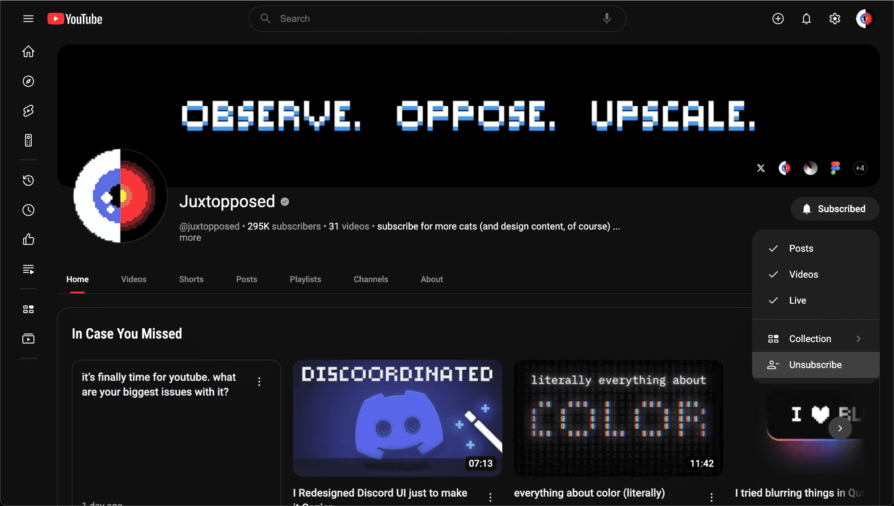

## Channel Brief Popup
Get quick insights into channels without leaving the page.

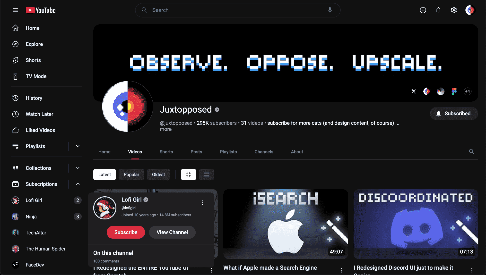

## Keyboard Shortcuts: Control at Your Fingertips ⌨️

| Key           | Effect                          |
|---------------|---------------------------------|
| `Space` or `k`| Play / Pause                    |
| `m`           | Mute / Unmute                   |
| `c`           | Toggle Closed Captions (On/Off) |
| `t`           | Toggle Theater Mode (On/Off)    |
| `f`           | Toggle Fullscreen Mode (On/Off) |

## Work In Progress: Join the Journey 🚧

This project is a testament to the power of Kotlin/JS and Jetpack Compose for Web. While it's still evolving, it showcases the potential for building rich, interactive web applications. If you're an Android developer curious about web development, this is your perfect starting point!

## Contribute & Collaborate 🤝🏻

We welcome contributions! Fork this repo, experiment, and submit your pull requests. Let's build something amazing together.

  <h2>🌟 If you find this project exciting, please give it a star! 🌟</h2>

